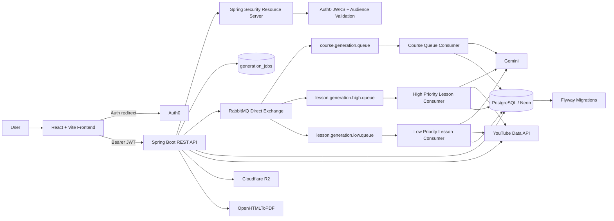
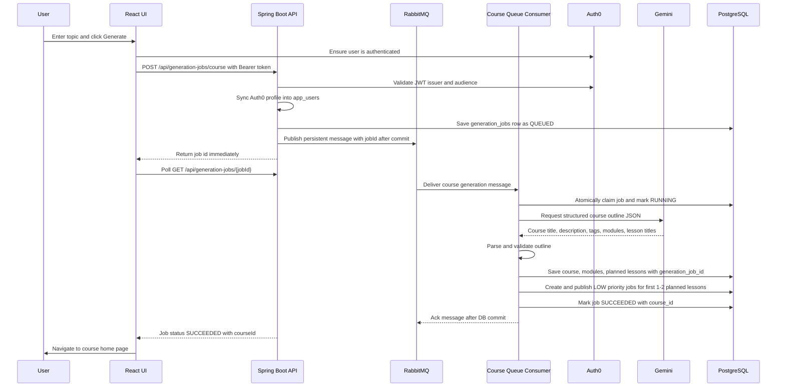
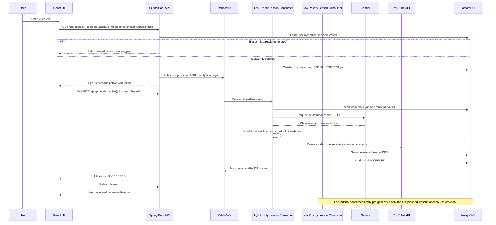
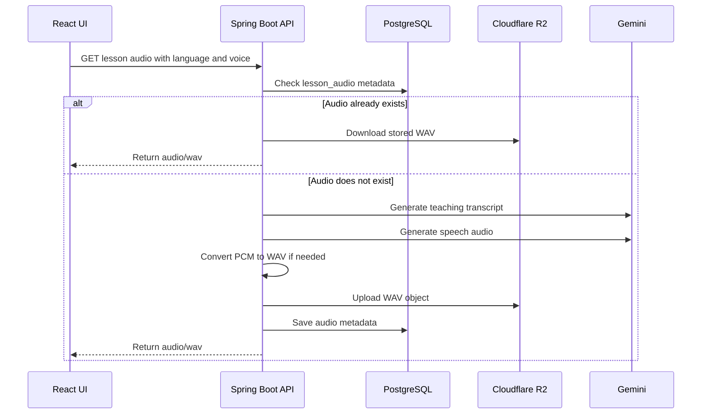
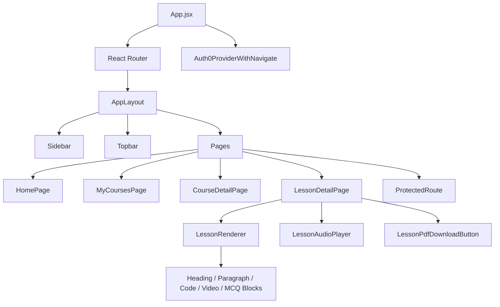
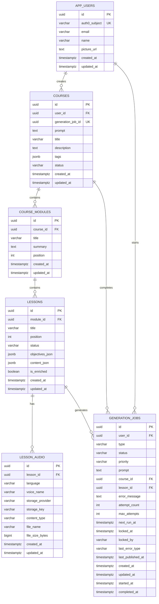
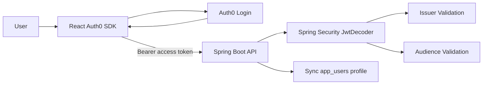
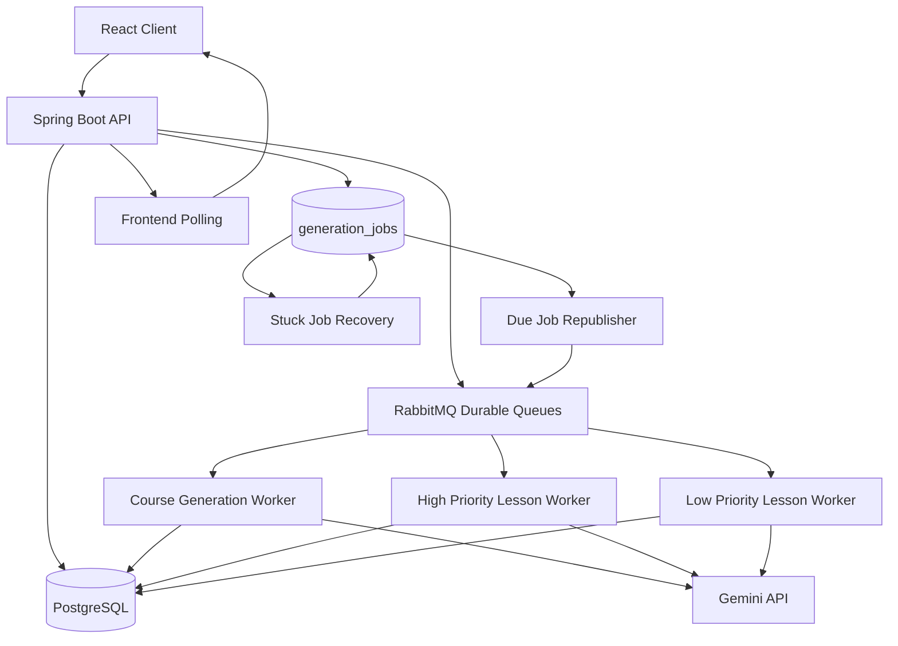

# Text To Learn AI

Text To Learn AI is an AI-enabled full-stack learning platform that turns a user prompt into a structured, multimedia course. A user can enter any topic, generate a course home page with modules and lessons, open lessons on demand, view structured content, embedded videos, quizzes, multilingual audio explanations, and download lessons as PDFs.

The project is built as a production-shaped Java + React application with OAuth2 security, PostgreSQL persistence, AI output validation, lazy generation, media enrichment, object storage, and server-side document generation.

## Table Of Contents

- [Core Features](#core-features)
- [Current Architecture](#current-architecture)
- [Request Flow](#request-flow)
- [Backend Architecture](#backend-architecture)
- [Frontend Architecture](#frontend-architecture)
- [Database Design](#database-design)
- [AI Generation Design](#ai-generation-design)
- [Authentication And Security](#authentication-and-security)
- [External Integrations](#external-integrations)
- [API Overview](#api-overview)
- [Configuration](#configuration)
- [Running Locally](#running-locally)
- [Testing](#testing)
- [Project Structure](#project-structure)
- [Current Limitations](#current-limitations)
- [Implemented Queue Architecture](#implemented-queue-architecture)
- [Production Roadmap](#production-roadmap)
- [Resume Highlights](#resume-highlights)

## Core Features

- AI course outline generation from any user topic.
- Asynchronous course generation with persisted job status tracking and frontend polling.
- Lazy lesson generation: the course outline is generated first, while each lesson is generated only when the user opens it.
- Structured lesson renderer for headings, paragraphs, code blocks, video blocks, and MCQs.
- Gemini structured JSON prompting with backend parsing, validation, retries, normalization, and fallback content.
- Auth0 OAuth2/JWT authentication with backend token validation and user profile sync.
- PostgreSQL persistence using JPA entities and Flyway migrations.
- YouTube Data API enrichment for AI-generated video search queries.
- Server-side lesson PDF generation using OpenHTMLToPDF.
- Multilingual audio explanations using Gemini transcript generation and Gemini TTS.
- Cloudflare R2 audio storage with metadata stored in PostgreSQL.
- Responsive React + Vite frontend using Tailwind CSS and dark mode.
- GitHub Actions CI for backend tests and frontend production builds.
- Dockerized backend, frontend, local PostgreSQL, and RabbitMQ setup through Docker Compose.
- RabbitMQ-backed AI job pipeline with durable queues, priority lesson workers, retry/backoff, republishing, and stale-job recovery.
- User-specific course storage through protected APIs.

## Current Architecture



The React client talks only to the Spring Boot API. The backend owns authentication validation, database access, AI calls, video lookup, audio storage, and PDF generation. PostgreSQL is the source of truth for users, courses, modules, lessons, generated JSON content, generated audio metadata, and generation job state. RabbitMQ is used only for durable delivery of lightweight job messages; each message carries a job id, and workers load the authoritative job state from PostgreSQL. A republisher scheduler recovers missed publishes, and a stuck-job recovery scheduler requeues stale `RUNNING` jobs after conservative timeouts.

## Request Flow

### Async Course Creation



### Async Lesson Generation



### Audio Generation



## Backend Architecture

The backend is a Java 21 Spring Boot application.

| Layer        | Responsibility                                                                                              |
| ------------ | ----------------------------------------------------------------------------------------------------------- |
| Controllers  | Expose REST APIs under `/api/**`                                                                            |
| Services     | Own business logic for course generation, lesson generation, audio, video lookup, PDF export, and user sync |
| Repositories | Spring Data JPA repositories for PostgreSQL persistence                                                     |
| Models       | JPA entities for users, courses, modules, lessons, and generated audio metadata                             |
| Security     | Auth0 JWT validation, issuer validation, audience validation, protected APIs                                |
| Migrations   | Flyway SQL migrations for schema evolution                                                                  |
| AI           | Gemini/OpenAI provider abstraction through `CourseAiService`                                                |
| Queueing     | RabbitMQ durable queues for course, high-priority lesson, and low-priority lesson generation jobs           |
| Media        | YouTube Data API and Cloudflare R2 integrations                                                             |

### Backend Stack

- Java 21
- Spring Boot 4
- Spring Web MVC
- Spring Data JPA
- Spring Security
- OAuth2 Resource Server
- PostgreSQL
- Flyway
- H2 for tests
- RabbitMQ
- Gemini API
- YouTube Data API v3
- Cloudflare R2 via AWS S3 SDK
- OpenHTMLToPDF

### Queue Reliability Model

The generation pipeline is designed around at-least-once message delivery:

- RabbitMQ queues and the direct exchange are durable.
- Published job messages are persistent.
- RabbitMQ messages contain only `{ "jobId": "..." }`.
- Workers use manual acknowledgements and acknowledge only after the database transition is complete.
- Consumer prefetch is `1` for long-running AI work so one worker does not hoard messages.
- High-priority lesson generation has a small dedicated concurrency, while low-priority background generation is kept at concurrency `1`.
- PostgreSQL decides whether a job should actually run. Duplicate RabbitMQ deliveries are safe because workers atomically claim only `QUEUED` jobs.
- Course creation is idempotent because `courses.generation_job_id` is unique.
- Active job partial indexes prevent duplicate active course jobs per user and duplicate active lesson jobs per lesson.
- Retryable errors are requeued with backoff; permanent errors fail fast.
- The republisher scheduler republishes due `QUEUED` jobs whose `last_published_at` is old or missing.
- The recovery scheduler requeues stale `RUNNING` jobs after `20` minutes for course jobs and `10` minutes for lesson jobs.

This gives effectively-once side effects on top of RabbitMQ's at-least-once delivery model.

## Frontend Architecture

The frontend is a React 19 + Vite 7 single-page application.



### Frontend Stack

- React 19
- Vite 7
- React Router
- Auth0 React SDK
- Tailwind CSS
- Context API for shared layout state
- Token-aware API client

### Main Routes

| Route                                                        | Purpose                                                     |
| ------------------------------------------------------------ | ----------------------------------------------------------- |
| `/`                                                          | Home page and course prompt form                            |
| `/login`                                                     | Auth0 login entry page                                      |
| `/signup`                                                    | Auth0 signup entry page                                     |
| `/courses`                                                   | User's generated courses                                    |
| `/courses/:courseId`                                         | Course home page with modules and lesson outline            |
| `/courses/:courseId/module/:moduleIndex/lesson/:lessonIndex` | Lesson viewer with content, audio, videos, and PDF download |

## Database Design

The database is PostgreSQL. Flyway owns schema evolution and Hibernate runs in validation mode.



### Important Design Choices

- `app_users.auth0_subject` stores the Auth0 identity and links application data to authenticated users.
- Course outlines are stored relationally as courses, modules, and planned lessons.
- Long-running course and lesson generation are tracked in `generation_jobs` so HTTP requests do not wait for LLM calls.
- RabbitMQ queues carry only lightweight job ids. PostgreSQL remains the source of truth for job ownership, state, retry attempts, locks, and result ids.
- Generation workers atomically claim queued jobs, increment attempt counts, and acknowledge RabbitMQ messages only after database state is committed.
- Course creation is idempotent through `courses.generation_job_id`, so duplicate RabbitMQ deliveries do not create duplicate courses.
- Partial unique indexes prevent duplicate active course jobs per user and duplicate active lesson jobs per lesson.
- Atomic job claiming changes a job from `QUEUED` to `RUNNING`, increments `attempt_count`, and sets `locked_at`, `locked_by`, and `started_at` in one database transition.
- Retry/backoff, failure classification, republishing, and stuck-job recovery protect the queue from transient AI/API failures and crashed workers.
- Generated lesson content is stored as JSONB in `lessons.content_json` because each lesson contains flexible block types.
- Lesson objectives are stored as JSONB in `lessons.objectives_json`.
- YouTube video metadata is embedded inside video blocks in `content_json`, so the PDF and UI show the same selected videos.
- Generated audio files are stored outside the database in Cloudflare R2. PostgreSQL stores only metadata and object keys.

### Flyway Migration History

| Migration | Purpose |
| --------- | ------- |
| `V1__create_learning_items.sql` | Initial learning item experiment |
| `V2__replace_learning_items_with_course_schema.sql` | Replaced the initial table with course/module/lesson schema |
| `V3__align_course_schema_with_roadmap.sql` | Aligned course fields with the generated course roadmap |
| `V4__create_lesson_audio.sql` | Added audio metadata storage for generated lesson audio |
| `V5__create_generation_jobs.sql` | Added async course generation job tracking |
| `V6__upgrade_generation_jobs_for_queueing.sql` | Added priority, retry, locking, publishing, and lesson-job fields |
| `V7__create_generation_job_active_partial_indexes.java` | Added PostgreSQL partial unique indexes for active job protection while keeping tests portable |
| `V8__increase_generation_job_retry_attempts.sql` | Increased default retry attempts for generation jobs |

## AI Generation Design

The app uses a provider abstraction:

```text
CourseAiService
+-- GeminiCourseAiService
+-- OpenAiCourseAiService
```

Gemini is the default provider.

### Course Outline Prompt

The course prompt asks the model to return only a JSON object containing:

- course title
- description
- tags
- modules
- lesson titles

The backend validates that:

- course title exists
- modules exist
- each module has a title
- each module has lessons
- lesson titles are not blank

### Lesson Prompt

The lesson prompt asks the model to return only JSON with:

- lesson title
- learning objectives
- content blocks

Supported content block types:

```text
heading
paragraph
code
video
mcq
```

### AI Reliability Controls

The current backend includes:

- Gemini `responseMimeType=application/json`
- Gemini `responseSchema` for course and lesson outputs
- strict JSON parsing into Java DTOs
- lesson JSON retry attempts
- fallback lesson content if lesson JSON cannot be recovered
- validation for missing course/module/lesson structure
- validation for lesson objectives and content blocks
- code block normalization when Gemini returns code in unexpected fields
- safe fallback paragraph when a code block has no source code
- lesson block reordering so MCQs stay at the end and videos are not grouped awkwardly

This is not a complete formal schema validator for every field yet, but it is enough to make AI responses safer for rendering and persistence.

## Authentication And Security

Auth0 is used for login and access tokens.



Security behavior:

- `/api/health` is public.
- `/api/**` endpoints require authentication.
- Spring Security validates issuer and audience.
- The backend calls Auth0 `/userinfo` when configured and falls back to JWT claims if needed.
- User records are created or updated in `app_users` whenever protected endpoints are called.
- CORS is restricted through `APP_CORS_ALLOWED_ORIGINS`.

## External Integrations

| Integration      | Purpose                                                                  |
| ---------------- | ------------------------------------------------------------------------ |
| Auth0            | User authentication and JWT issuance                                     |
| Gemini API       | Course outline generation, lesson generation, transcript generation, TTS |
| YouTube Data API | Educational video lookup for lesson video blocks                         |
| Cloudflare R2    | Persistent storage for generated WAV audio files                         |
| PostgreSQL/Neon  | Main relational database                                                 |
| RabbitMQ         | Durable delivery for course and lesson generation jobs                   |

## API Overview

All endpoints except `/api/health` require an Auth0 Bearer token.

| Method | Endpoint                                                                  | Purpose                                        |
| ------ | ------------------------------------------------------------------------- | ---------------------------------------------- |
| `GET`  | `/api/health`                                                             | Public health check                            |
| `GET`  | `/api/users/me`                                                           | Sync and return the current authenticated user |
| `POST` | `/api/generation-jobs/course`                                             | Create an async course generation job          |
| `GET`  | `/api/generation-jobs/{jobId}`                                            | Poll a user-owned generation job               |
| `POST` | `/api/courses`                                                            | Direct synchronous course creation path        |
| `GET`  | `/api/courses`                                                            | List current user's courses                    |
| `GET`  | `/api/courses/{courseId}`                                                 | Get one course outline                         |
| `GET`  | `/api/courses/{courseId}/module/{moduleIndex}/lesson/{lessonIndex}`       | Return a generated lesson or enqueue/reuse a lesson job |
| `GET`  | `/api/courses/{courseId}/module/{moduleIndex}/lesson/{lessonIndex}/audio` | Generate or fetch lesson audio                 |
| `GET`  | `/api/courses/{courseId}/module/{moduleIndex}/lesson/{lessonIndex}/pdf`   | Generate a lesson PDF                          |
| `GET`  | `/api/youtube?query=...&maxResults=...`                                   | Search YouTube educational videos              |

The frontend uses the async generation-job endpoint for course creation. The direct `POST /api/courses` path is kept as a synchronous service path for development/testing, but the production-shaped user flow is queue-backed.

### Example Async Course Request

```http
POST /api/generation-jobs/course
Authorization: Bearer <access-token>
Content-Type: application/json

{
  "topic": "Segment Trees and Its Applications"
}
```

Example response:

```json
{
  "id": "2b7a6a54-f2c3-4f7f-8a9d-47abfe90bd23",
  "type": "COURSE_OUTLINE",
  "status": "QUEUED",
  "priority": "NORMAL",
  "prompt": "Segment Trees and Its Applications",
  "courseId": null,
  "lessonId": null,
  "errorMessage": null
}
```

The client then polls `GET /api/generation-jobs/{jobId}` until the status becomes `SUCCEEDED` or `FAILED`.

### Example Lesson Content Shape

```json
{
  "title": "Range Sum Query",
  "objectives": [
    "Understand what range queries solve",
    "Explain how segment trees answer range sums",
    "Identify when segment trees are useful"
  ],
  "content": [
    {
      "type": "heading",
      "text": "Range Sum Query"
    },
    {
      "type": "paragraph",
      "text": "A range sum query asks for the sum of values between two indexes."
    },
    {
      "type": "video",
      "title": "Range sum query walkthrough",
      "query": "segment tree range sum query tutorial",
      "maxResults": 1,
      "videos": [
        {
          "videoId": "abc123",
          "title": "Segment Tree Tutorial",
          "channelTitle": "Algorithms Channel",
          "embedUrl": "https://www.youtube.com/embed/abc123",
          "watchUrl": "https://www.youtube.com/watch?v=abc123",
          "thumbnailUrl": "https://i.ytimg.com/vi/abc123/mqdefault.jpg"
        }
      ]
    }
  ]
}
```

## Configuration

### Backend Environment Variables

| Variable                            | Required             | Purpose                                            |
| ----------------------------------- | -------------------- | -------------------------------------------------- |
| `SPRING_DATASOURCE_URL`             | Yes                  | PostgreSQL JDBC URL                                |
| `SPRING_DATASOURCE_USERNAME`        | Yes                  | Database username                                  |
| `SPRING_DATASOURCE_PASSWORD`        | Yes                  | Database password                                  |
| `RABBITMQ_HOST`                     | Yes for queues       | RabbitMQ host                                      |
| `RABBITMQ_PORT`                     | Yes for queues       | RabbitMQ AMQP port                                 |
| `RABBITMQ_USERNAME`                 | Yes for queues       | RabbitMQ username                                  |
| `RABBITMQ_PASSWORD`                 | Yes for queues       | RabbitMQ password                                  |
| `AUTH0_ISSUER_URI`                  | Yes for auth         | Auth0 issuer URL                                   |
| `AUTH0_AUDIENCE`                    | Yes for auth         | API audience expected in access tokens             |
| `AUTH0_JWK_SET_URI`                 | Optional             | Auth0 JWKS URL; derived from issuer if omitted     |
| `APP_CORS_ALLOWED_ORIGINS`          | Recommended          | Allowed frontend origins                           |
| `APP_GENERATION_REPUBLISHER_ENABLED` | Optional            | Enables missed-publish recovery                    |
| `APP_GENERATION_REPUBLISHER_FIXED_DELAY_MS` | Optional     | Republisher scheduler delay                        |
| `APP_GENERATION_RECOVERY_ENABLED`   | Optional             | Enables stale running-job recovery                 |
| `APP_GENERATION_RECOVERY_FIXED_DELAY_MS` | Optional        | Stuck-job recovery scheduler delay                 |
| `AI_PROVIDER`                       | Optional             | `gemini` by default, `openai` also supported       |
| `GEMINI_API_KEY`                    | Yes for Gemini       | Gemini API key                                     |
| `GEMINI_MODEL`                      | Optional             | Defaults to `gemini-2.5-flash`                     |
| `GEMINI_TTS_MODEL`                  | Optional             | Defaults to `gemini-2.5-flash-preview-tts`         |
| `GEMINI_TTS_VOICE_NAME`             | Optional             | Default TTS voice                                  |
| `GEMINI_AUDIO_MAX_INPUT_CHARACTERS` | Optional             | Maximum lesson text sent for transcript generation |
| `OPENAI_API_KEY`                    | If using OpenAI      | OpenAI API key                                     |
| `OPENAI_MODEL`                      | If using OpenAI      | OpenAI model                                       |
| `YOUTUBE_API_KEY`                   | Recommended          | YouTube Data API key                               |
| `YOUTUBE_MAX_RESULTS`               | Optional             | Max videos returned per lookup                     |
| `YOUTUBE_CACHE_TTL_MINUTES`         | Optional             | In-memory YouTube cache TTL                        |
| `R2_ACCOUNT_ID`                     | For persistent audio | Cloudflare account ID                              |
| `R2_ACCESS_KEY_ID`                  | For persistent audio | R2 access key                                      |
| `R2_SECRET_ACCESS_KEY`              | For persistent audio | R2 secret key                                      |
| `R2_BUCKET_NAME`                    | For persistent audio | R2 bucket name                                     |
| `R2_ENDPOINT`                       | Optional             | Explicit R2 endpoint override                      |

### Frontend Environment Variables

Create `client/.env.local`:

```bash
VITE_API_BASE_URL=http://localhost:8081
VITE_AUTH0_DOMAIN=your-auth0-domain.us.auth0.com
VITE_AUTH0_CLIENT_ID=your-auth0-spa-client-id
VITE_AUTH0_AUDIENCE=https://text-to-learn-api
```

## Running Locally

### Prerequisites

- Java 21 or newer
- Node.js 20 or newer
- PostgreSQL 17 locally, Neon, or the Docker Compose Postgres service
- RabbitMQ, or the Docker Compose RabbitMQ service
- Docker Desktop if running the containerized stack
- Auth0 SPA application and API audience
- Gemini API key
- YouTube API key for video enrichment
- Cloudflare R2 credentials if persistent audio storage is needed

### Option A: Run With Docker Compose

Create a Docker env file:

```bash
cp .env.docker.example .env.docker
```

Edit `.env.docker` and fill in at least:

```bash
VITE_AUTH0_DOMAIN=your-auth0-domain.us.auth0.com
VITE_AUTH0_CLIENT_ID=your-auth0-spa-client-id
VITE_AUTH0_AUDIENCE=https://text-to-learn-api

AUTH0_ISSUER_URI=https://your-auth0-domain.us.auth0.com/
AUTH0_AUDIENCE=https://text-to-learn-api
AUTH0_JWK_SET_URI=https://your-auth0-domain.us.auth0.com/.well-known/jwks.json

GEMINI_API_KEY=your-gemini-api-key
YOUTUBE_API_KEY=your-youtube-api-key

RABBITMQ_USERNAME=text_to_learn
RABBITMQ_PASSWORD=text_to_learn
```

For Auth0 local Docker testing, add this URL in the Auth0 SPA application settings:

```text
Allowed Callback URLs: http://localhost:3000
Allowed Logout URLs:   http://localhost:3000
Allowed Web Origins:   http://localhost:3000
```

Start the full stack:

```bash
docker compose --env-file .env.docker up --build
```

The Docker stack exposes:

```text
Frontend:   http://localhost:3000
Backend:    http://localhost:8081
PostgreSQL: localhost:5433
RabbitMQ:   http://localhost:15672
```

RabbitMQ management login defaults to the `RABBITMQ_USERNAME` and `RABBITMQ_PASSWORD` values in `.env.docker`. The Compose stack also exposes AMQP on `localhost:5672`.

The Docker frontend is served by Nginx. Browser requests to `/api` are proxied inside Docker to the backend container, so `VITE_API_BASE_URL` should stay empty in `.env.docker`.

By default, the Docker backend uses the PostgreSQL container at `jdbc:postgresql://postgres:5432/text_to_learn`. This is intentional: normal terminal exports like `SPRING_DATASOURCE_URL` are ignored by Docker Compose to prevent accidentally connecting the containerized app to Neon. If you intentionally want Docker to use Neon, set `DOCKER_SPRING_DATASOURCE_URL`, `DOCKER_SPRING_DATASOURCE_USERNAME`, and `DOCKER_SPRING_DATASOURCE_PASSWORD` in `.env.docker`.

Useful queue-backed validation commands:

```bash
curl http://localhost:8081/api/health
docker exec text-to-learn-rabbitmq rabbitmqctl list_queues name durable messages consumers
docker exec -it text-to-learn-postgres psql -U text_to_learn -d text_to_learn
```

Inside `psql`, inspect the latest generation jobs:

```sql
select id, type, priority, status, course_id, lesson_id, attempt_count,
       last_error_type, error_message, created_at, started_at, completed_at
from generation_jobs
order by created_at desc
limit 10;
```

Expected RabbitMQ queues:

```text
course.generation.queue
lesson.generation.high.queue
lesson.generation.low.queue
```

If RabbitMQ starts but the queue list is empty, check the backend logs. The queues are declared by the Spring Boot app on startup through RabbitAdmin, so RabbitMQ alone can be healthy while no generation queues exist yet.

To stop the stack:

```bash
docker compose down
```

To also delete the local Docker database volume:

```bash
docker compose down -v
```

### Option B: Run Manually

#### 1. Start PostgreSQL And RabbitMQ Locally

You can start only the local infrastructure services from Docker Compose:

```bash
docker compose up -d postgres rabbitmq
```

This starts PostgreSQL with:

```text
Database: text_to_learn
User: text_to_learn
Password: text_to_learn
Port: 5433 on your Mac, forwarded to 5432 inside the container
```

It also starts RabbitMQ with:

```text
Management UI: http://localhost:15672
AMQP port:     localhost:5672
User:          text_to_learn
Password:      text_to_learn
```

#### 2. Start The Backend

If your machine has multiple Java versions, set Java 21+ first. On macOS, Java 23 also works for this project:

```bash
export JAVA_HOME=$(/usr/libexec/java_home -v 23)
export PATH="$JAVA_HOME/bin:$PATH"
```

Then configure the backend:

```bash
export AUTH0_ISSUER_URI='https://your-auth0-domain.us.auth0.com/'
export AUTH0_AUDIENCE='https://text-to-learn-api'

export SPRING_DATASOURCE_URL='jdbc:postgresql://localhost:5433/text_to_learn'
export SPRING_DATASOURCE_USERNAME='text_to_learn'
export SPRING_DATASOURCE_PASSWORD='text_to_learn'

export RABBITMQ_HOST='localhost'
export RABBITMQ_PORT='5672'
export RABBITMQ_USERNAME='text_to_learn'
export RABBITMQ_PASSWORD='text_to_learn'

export AI_PROVIDER='gemini'
export GEMINI_API_KEY='your-gemini-api-key'
export GEMINI_MODEL='gemini-2.5-flash'

export YOUTUBE_API_KEY='your-youtube-api-key'

export R2_ACCOUNT_ID='your-cloudflare-account-id'
export R2_ACCESS_KEY_ID='your-r2-access-key-id'
export R2_SECRET_ACCESS_KEY='your-r2-secret-access-key'
export R2_BUCKET_NAME='text-to-learn-audio'
```

Start the backend:

```bash
./mvnw spring-boot:run
```

Expected startup signal:

```text
Tomcat started on port 8081
Started TextToLearnApplication
```

#### 3. Start The Frontend

```bash
cd client
npm install
npm run dev
```

The frontend runs at:

```text
http://localhost:5173
```

Vite proxies `/api` requests to the backend at `http://localhost:8081`.

## Testing

Run backend tests:

```bash
./mvnw test
```

Run frontend production build:

```bash
cd client
npm run build
```

GitHub Actions runs both checks automatically on pushes and pull requests to `main`:

- Backend: `./mvnw test` on Temurin Java 21
- Frontend: `npm ci` and `npm run build` on Node.js 20

Current tests cover:

- Spring Boot context loading
- Course repository behavior
- Course service video enrichment and lesson ordering behavior
- Generation job creation, ownership checks, duplicate active-job reuse, and priority promotion
- RabbitMQ-backed worker behavior through the generation service abstraction
- Idempotent course result creation for duplicate course job processing
- Low-priority lesson pre-generation after course creation
- Retryable and permanent failure handling, backoff, republishing, and stale-job recovery
- Gemini parsing and fallback behavior
- Prompt builder rules
- YouTube response parsing
- Lesson PDF rendering
- Lesson audio parsing, transcript handling, and WAV conversion helpers

## Project Structure

```text
.
+-- src/main/java/com/texttolearn
|   +-- ai                 # AI provider config, prompts, Gemini/OpenAI services
|   +-- audio              # Gemini TTS, audio metadata, R2 object storage
|   +-- common             # Error handling and shared exceptions
|   +-- config             # CORS and Jackson configuration
|   +-- course             # Course/module/lesson domain, APIs, services
|   +-- generation         # RabbitMQ-backed AI generation jobs, publishers, listeners, and workers
|   +-- health             # Public health endpoint
|   +-- pdf                # Server-side PDF generation
|   +-- security           # Auth0 JWT resource server setup
|   +-- user               # App user profile sync and persistence
|   +-- video              # YouTube Data API integration
+-- src/main/resources
|   +-- application.properties
|   +-- db/migration       # Flyway migrations
+-- src/test               # Backend tests
+-- client
|   +-- Dockerfile         # Frontend production image
|   +-- nginx.conf         # Serves React and proxies /api to backend
|   +-- src
|   |   +-- components     # Layout, auth, UI, course, lesson components
|   |   +-- context        # Shared app context
|   |   +-- hooks          # Auth/API/app hooks
|   |   +-- pages          # Route-level pages
|   |   +-- services       # Auth0 provider/config
|   |   +-- utils          # API client, routes, theme, audio options
|   +-- tailwind.config.js
|   +-- vite.config.js
+-- Dockerfile             # Backend production image
+-- docker-compose.yml     # Full-stack local Docker environment
+-- .env.docker.example    # Example env file for Docker Compose
```

## Current Limitations

This project intentionally keeps some production concerns simple while the core AI learning flow is being built.

- RabbitMQ consumers currently run inside the same Spring Boot application as the REST API. A larger deployment could split API and worker processes into separate services.
- Frontend progress updates use polling with backoff. WebSocket/STOMP updates can be added later for lower-latency notifications.
- There is no semantic/vector cache yet for similar lesson reuse.
- Retry/failure state is stored in PostgreSQL, but there is no RabbitMQ dead-letter queue dashboard yet.
- The backend has active-job guardrails, but does not yet enforce per-user daily AI quota limits.
- YouTube cache is in-memory, so it resets when the backend restarts.
- The local Docker Compose stack is production-like for development, but cloud deployment and CD are still future work.

## Implemented Queue Architecture

The current async course and lesson generation pipeline is:



This flow is already implemented locally through Spring Boot, PostgreSQL, RabbitMQ, Gemini workers, and frontend polling. The remaining roadmap is about deployment hardening, observability, and further scaling.

## Production Roadmap

Planned improvements:

1. Extend GitHub Actions from CI to deployment after hosting targets are ready.
2. Split the API and RabbitMQ workers into separately scalable deployment units.
3. Add WebSocket/STOMP notifications while keeping polling as a fallback.
4. Add RabbitMQ dead-letter queues and an operational failure dashboard.
5. Add per-user daily quota limits and admin-visible AI usage metrics.
6. Add semantic caching with embeddings/vector search to reduce duplicate AI calls for similar lessons.

## Resume Highlights

Text To Learn AI demonstrates:

- Full-stack AI application development with Java, Spring Boot, React, and PostgreSQL.
- LLM prompt design for structured JSON generation.
- Backend AI validation, normalization, retry handling, and fallback behavior.
- RabbitMQ-backed async generation with PostgreSQL job state, atomic claiming, retry/backoff, stuck-job recovery, priority lesson queues, active-job guardrails, and polling-based progress tracking.
- Lazy generation and persistence to avoid repeated AI calls for generated lessons.
- OAuth2/JWT authentication with Auth0 and Spring Security.
- Integration with Gemini, YouTube Data API, and Cloudflare R2.
- Server-side PDF generation from structured lesson data.
- Multimedia learning workflow with text, code, videos, quizzes, PDFs, and audio explanations.
