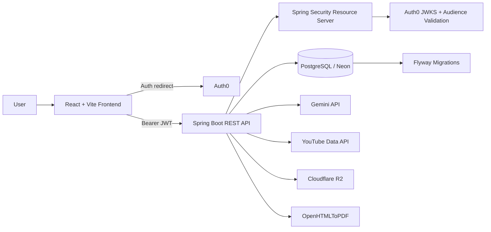
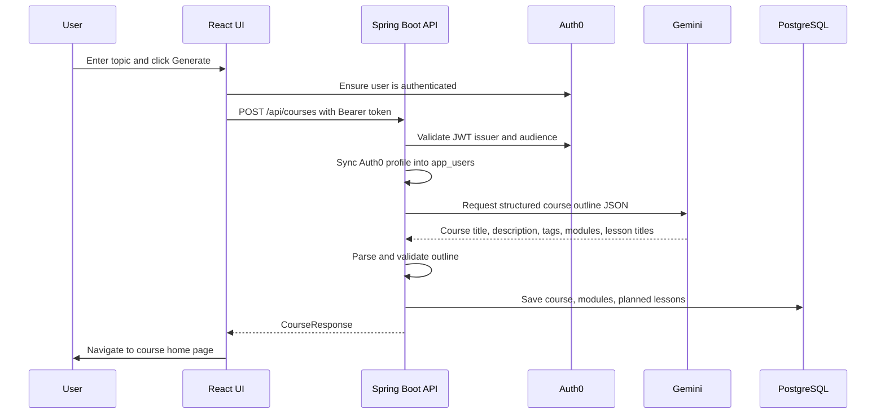
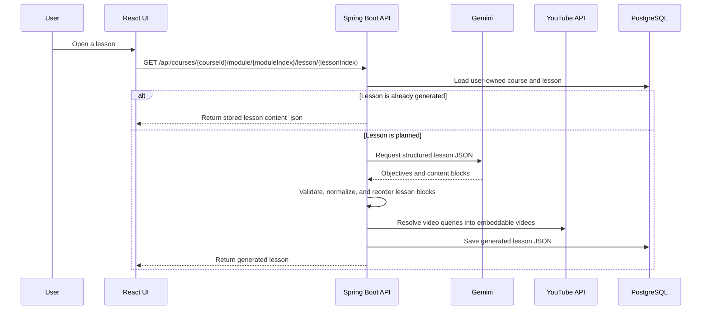
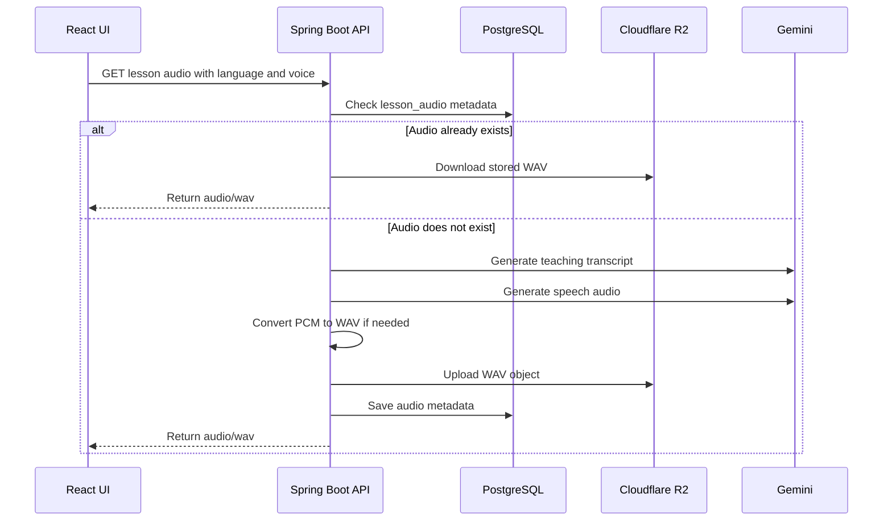
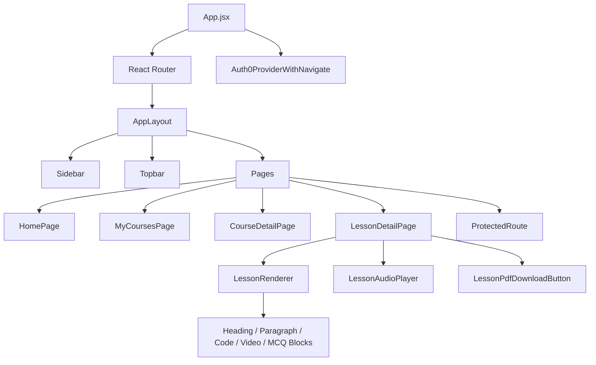
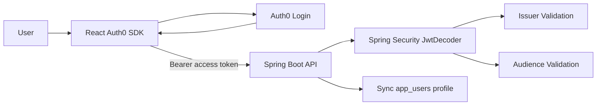
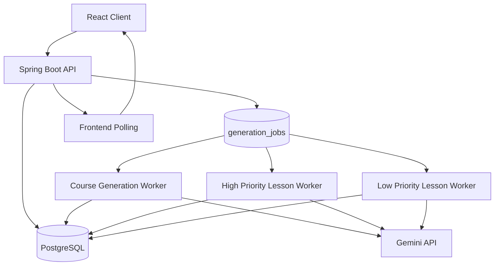

# Text To Learn AI

Text To Learn AI is an AI-enabled full-stack learning platform that turns a user prompt into a structured, multimedia course. A user can enter any topic, generate a course home page with modules and lessons, open lessons on demand, view structured content, embedded videos, quizzes, multilingual audio explanations, and download lessons as PDFs.

The project is built as a production-shaped Java + React application with OAuth2 security, PostgreSQL persistence, AI output validation, lazy generation, media enrichment, object storage, and server-side document generation.

## Table Of Contents

- [Core Features](#core-features)
- [Current Architecture](#current-architecture)
- [Request Flow](#request-flow)
- [Backend Architecture](#backend-architecture)
- [Frontend Architecture](#frontend-architecture)
- [Database Design](#database-design)
- [AI Generation Design](#ai-generation-design)
- [Authentication And Security](#authentication-and-security)
- [External Integrations](#external-integrations)
- [API Overview](#api-overview)
- [Configuration](#configuration)
- [Running Locally](#running-locally)
- [Testing](#testing)
- [Project Structure](#project-structure)
- [Current Limitations](#current-limitations)
- [Production Roadmap](#production-roadmap)
- [Resume Highlights](#resume-highlights)

## Core Features

- AI course outline generation from any user topic.
- Lazy lesson generation: the course outline is generated first, while each lesson is generated only when the user opens it.
- Structured lesson renderer for headings, paragraphs, code blocks, video blocks, and MCQs.
- Gemini structured JSON prompting with backend parsing, validation, retries, normalization, and fallback content.
- Auth0 OAuth2/JWT authentication with backend token validation and user profile sync.
- PostgreSQL persistence using JPA entities and Flyway migrations.
- YouTube Data API enrichment for AI-generated video search queries.
- Server-side lesson PDF generation using OpenHTMLToPDF.
- Multilingual audio explanations using Gemini transcript generation and Gemini TTS.
- Cloudflare R2 audio storage with metadata stored in PostgreSQL.
- Responsive React + Vite frontend using Tailwind CSS and dark mode.
- User-specific course storage through protected APIs.

## Current Architecture



The React client talks only to the Spring Boot API. The backend owns authentication validation, database access, AI calls, video lookup, audio storage, and PDF generation. PostgreSQL is the source of truth for users, courses, modules, lessons, generated JSON content, and generated audio metadata.

## Request Flow

### Course Creation



### Lazy Lesson Generation



### Audio Generation



## Backend Architecture

The backend is a Java 21 Spring Boot application.

| Layer        | Responsibility                                                                                              |
| ------------ | ----------------------------------------------------------------------------------------------------------- |
| Controllers  | Expose REST APIs under `/api/**`                                                                            |
| Services     | Own business logic for course generation, lesson generation, audio, video lookup, PDF export, and user sync |
| Repositories | Spring Data JPA repositories for PostgreSQL persistence                                                     |
| Models       | JPA entities for users, courses, modules, lessons, and generated audio metadata                             |
| Security     | Auth0 JWT validation, issuer validation, audience validation, protected APIs                                |
| Migrations   | Flyway SQL migrations for schema evolution                                                                  |
| AI           | Gemini/OpenAI provider abstraction through `CourseAiService`                                                |
| Media        | YouTube Data API and Cloudflare R2 integrations                                                             |

### Backend Stack

- Java 21
- Spring Boot 4
- Spring Web MVC
- Spring Data JPA
- Spring Security
- OAuth2 Resource Server
- PostgreSQL
- Flyway
- H2 for tests
- Gemini API
- YouTube Data API v3
- Cloudflare R2 via AWS S3 SDK
- OpenHTMLToPDF

## Frontend Architecture

The frontend is a React 19 + Vite 7 single-page application.



### Frontend Stack

- React 19
- Vite 7
- React Router
- Auth0 React SDK
- Tailwind CSS
- Context API for shared layout state
- Token-aware API client

### Main Routes

| Route                                                        | Purpose                                                     |
| ------------------------------------------------------------ | ----------------------------------------------------------- |
| `/`                                                          | Home page and course prompt form                            |
| `/login`                                                     | Auth0 login entry page                                      |
| `/signup`                                                    | Auth0 signup entry page                                     |
| `/courses`                                                   | User's generated courses                                    |
| `/courses/:courseId`                                         | Course home page with modules and lesson outline            |
| `/courses/:courseId/module/:moduleIndex/lesson/:lessonIndex` | Lesson viewer with content, audio, videos, and PDF download |

## Database Design

The database is PostgreSQL. Flyway owns schema evolution and Hibernate runs in validation mode.

```mermaid
erDiagram
    APP_USERS ||--o{ COURSES : creates
    COURSES ||--o{ COURSE_MODULES : contains
    COURSE_MODULES ||--o{ LESSONS : contains
    LESSONS ||--o{ LESSON_AUDIO : has

    APP_USERS {
        uuid id PK
        varchar auth0_subject UK
        varchar email
        varchar name
        text picture_url
        timestamptz created_at
        timestamptz updated_at
    }

    COURSES {
        uuid id PK
        uuid user_id FK
        text prompt
        varchar title
        text description
        jsonb tags
        varchar status
        timestamptz created_at
        timestamptz updated_at
    }

    COURSE_MODULES {
        uuid id PK
        uuid course_id FK
        varchar title
        text summary
        int position
        timestamptz created_at
        timestamptz updated_at
    }

    LESSONS {
        uuid id PK
        uuid module_id FK
        varchar title
        int position
        varchar status
        jsonb objectives_json
        jsonb content_json
        boolean is_enriched
        timestamptz created_at
        timestamptz updated_at
    }

    LESSON_AUDIO {
        uuid id PK
        uuid lesson_id FK
        varchar language
        varchar voice_name
        varchar storage_provider
        varchar storage_key
        varchar content_type
        varchar file_name
        bigint file_size_bytes
        timestamptz created_at
        timestamptz updated_at
    }
```



### Important Design Choices

- `app_users.auth0_subject` stores the Auth0 identity and links application data to authenticated users.
- Course outlines are stored relationally as courses, modules, and planned lessons.
- Generated lesson content is stored as JSONB in `lessons.content_json` because each lesson contains flexible block types.
- Lesson objectives are stored as JSONB in `lessons.objectives_json`.
- YouTube video metadata is embedded inside video blocks in `content_json`, so the PDF and UI show the same selected videos.
- Generated audio files are stored outside the database in Cloudflare R2. PostgreSQL stores only metadata and object keys.

## AI Generation Design

The app uses a provider abstraction:

```text
CourseAiService
+-- GeminiCourseAiService
+-- OpenAiCourseAiService
```

Gemini is the default provider.

### Course Outline Prompt

The course prompt asks the model to return only a JSON object containing:

- course title
- description
- tags
- modules
- lesson titles

The backend validates that:

- course title exists
- modules exist
- each module has a title
- each module has lessons
- lesson titles are not blank

### Lesson Prompt

The lesson prompt asks the model to return only JSON with:

- lesson title
- learning objectives
- content blocks

Supported content block types:

```text
heading
paragraph
code
video
mcq
```

### AI Reliability Controls

The current backend includes:

- Gemini `responseMimeType=application/json`
- Gemini `responseSchema` for course and lesson outputs
- strict JSON parsing into Java DTOs
- lesson JSON retry attempts
- fallback lesson content if lesson JSON cannot be recovered
- validation for missing course/module/lesson structure
- validation for lesson objectives and content blocks
- code block normalization when Gemini returns code in unexpected fields
- safe fallback paragraph when a code block has no source code
- lesson block reordering so MCQs stay at the end and videos are not grouped awkwardly

This is not a complete formal schema validator for every field yet, but it is enough to make AI responses safer for rendering and persistence.

## Authentication And Security

Auth0 is used for login and access tokens.



Security behavior:

- `/api/health` is public.
- `/api/**` endpoints require authentication.
- Spring Security validates issuer and audience.
- The backend calls Auth0 `/userinfo` when configured and falls back to JWT claims if needed.
- User records are created or updated in `app_users` whenever protected endpoints are called.
- CORS is restricted through `APP_CORS_ALLOWED_ORIGINS`.

## External Integrations

| Integration      | Purpose                                                                  |
| ---------------- | ------------------------------------------------------------------------ |
| Auth0            | User authentication and JWT issuance                                     |
| Gemini API       | Course outline generation, lesson generation, transcript generation, TTS |
| YouTube Data API | Educational video lookup for lesson video blocks                         |
| Cloudflare R2    | Persistent storage for generated WAV audio files                         |
| PostgreSQL/Neon  | Main relational database                                                 |

## API Overview

All endpoints except `/api/health` require an Auth0 Bearer token.

| Method | Endpoint                                                                  | Purpose                                        |
| ------ | ------------------------------------------------------------------------- | ---------------------------------------------- |
| `GET`  | `/api/health`                                                             | Public health check                            |
| `GET`  | `/api/users/me`                                                           | Sync and return the current authenticated user |
| `POST` | `/api/courses`                                                            | Generate and persist a new course outline      |
| `GET`  | `/api/courses`                                                            | List current user's courses                    |
| `GET`  | `/api/courses/{courseId}`                                                 | Get one course outline                         |
| `GET`  | `/api/courses/{courseId}/module/{moduleIndex}/lesson/{lessonIndex}`       | Return stored lesson or lazily generate it     |
| `GET`  | `/api/courses/{courseId}/module/{moduleIndex}/lesson/{lessonIndex}/audio` | Generate or fetch lesson audio                 |
| `GET`  | `/api/courses/{courseId}/module/{moduleIndex}/lesson/{lessonIndex}/pdf`   | Generate a lesson PDF                          |
| `GET`  | `/api/youtube?query=...&maxResults=...`                                   | Search YouTube educational videos              |

### Example Course Request

```http
POST /api/courses
Authorization: Bearer <access-token>
Content-Type: application/json

{
  "topic": "Segment Trees and Its Applications"
}
```

### Example Lesson Content Shape

```json
{
  "title": "Range Sum Query",
  "objectives": [
    "Understand what range queries solve",
    "Explain how segment trees answer range sums",
    "Identify when segment trees are useful"
  ],
  "content": [
    {
      "type": "heading",
      "text": "Range Sum Query"
    },
    {
      "type": "paragraph",
      "text": "A range sum query asks for the sum of values between two indexes."
    },
    {
      "type": "video",
      "title": "Range sum query walkthrough",
      "query": "segment tree range sum query tutorial",
      "maxResults": 1,
      "videos": [
        {
          "videoId": "abc123",
          "title": "Segment Tree Tutorial",
          "channelTitle": "Algorithms Channel",
          "embedUrl": "https://www.youtube.com/embed/abc123",
          "watchUrl": "https://www.youtube.com/watch?v=abc123",
          "thumbnailUrl": "https://i.ytimg.com/vi/abc123/mqdefault.jpg"
        }
      ]
    }
  ]
}
```

## Configuration

### Backend Environment Variables

| Variable                            | Required             | Purpose                                            |
| ----------------------------------- | -------------------- | -------------------------------------------------- |
| `SPRING_DATASOURCE_URL`             | Yes                  | PostgreSQL JDBC URL                                |
| `SPRING_DATASOURCE_USERNAME`        | Yes                  | Database username                                  |
| `SPRING_DATASOURCE_PASSWORD`        | Yes                  | Database password                                  |
| `AUTH0_ISSUER_URI`                  | Yes for auth         | Auth0 issuer URL                                   |
| `AUTH0_AUDIENCE`                    | Yes for auth         | API audience expected in access tokens             |
| `APP_CORS_ALLOWED_ORIGINS`          | Recommended          | Allowed frontend origins                           |
| `AI_PROVIDER`                       | Optional             | `gemini` by default, `openai` also supported       |
| `GEMINI_API_KEY`                    | Yes for Gemini       | Gemini API key                                     |
| `GEMINI_MODEL`                      | Optional             | Defaults to `gemini-2.5-flash`                     |
| `GEMINI_TTS_MODEL`                  | Optional             | Defaults to `gemini-2.5-flash-preview-tts`         |
| `GEMINI_TTS_VOICE_NAME`             | Optional             | Default TTS voice                                  |
| `GEMINI_AUDIO_MAX_INPUT_CHARACTERS` | Optional             | Maximum lesson text sent for transcript generation |
| `OPENAI_API_KEY`                    | If using OpenAI      | OpenAI API key                                     |
| `OPENAI_MODEL`                      | If using OpenAI      | OpenAI model                                       |
| `YOUTUBE_API_KEY`                   | Recommended          | YouTube Data API key                               |
| `YOUTUBE_MAX_RESULTS`               | Optional             | Max videos returned per lookup                     |
| `YOUTUBE_CACHE_TTL_MINUTES`         | Optional             | In-memory YouTube cache TTL                        |
| `R2_ACCOUNT_ID`                     | For persistent audio | Cloudflare account ID                              |
| `R2_ACCESS_KEY_ID`                  | For persistent audio | R2 access key                                      |
| `R2_SECRET_ACCESS_KEY`              | For persistent audio | R2 secret key                                      |
| `R2_BUCKET_NAME`                    | For persistent audio | R2 bucket name                                     |
| `R2_ENDPOINT`                       | Optional             | Explicit R2 endpoint override                      |

### Frontend Environment Variables

Create `client/.env.local`:

```bash
VITE_API_BASE_URL=http://localhost:8081
VITE_AUTH0_DOMAIN=your-auth0-domain.us.auth0.com
VITE_AUTH0_CLIENT_ID=your-auth0-spa-client-id
VITE_AUTH0_AUDIENCE=https://text-to-learn-api
```

## Running Locally

### Prerequisites

- Java 21 or newer
- Node.js 20 or newer
- PostgreSQL 17 locally, Neon, or the provided local Postgres Docker Compose service
- Auth0 SPA application and API audience
- Gemini API key
- YouTube API key for video enrichment
- Cloudflare R2 credentials if persistent audio storage is needed

### 1. Start PostgreSQL Locally

The repository currently includes Docker Compose for the database only:

```bash
docker compose up -d
```

This starts PostgreSQL with:

```text
Database: text_to_learn
User: text_to_learn
Password: text_to_learn
Port: 5432
```

### 2. Start The Backend

If your machine has multiple Java versions, set Java 21+ first. On macOS, Java 23 also works for this project:

```bash
export JAVA_HOME=$(/usr/libexec/java_home -v 23)
export PATH="$JAVA_HOME/bin:$PATH"
```

Then configure the backend:

```bash
export AUTH0_ISSUER_URI='https://your-auth0-domain.us.auth0.com/'
export AUTH0_AUDIENCE='https://text-to-learn-api'

export SPRING_DATASOURCE_URL='jdbc:postgresql://localhost:5432/text_to_learn'
export SPRING_DATASOURCE_USERNAME='text_to_learn'
export SPRING_DATASOURCE_PASSWORD='text_to_learn'

export AI_PROVIDER='gemini'
export GEMINI_API_KEY='your-gemini-api-key'
export GEMINI_MODEL='gemini-2.5-flash'

export YOUTUBE_API_KEY='your-youtube-api-key'

export R2_ACCOUNT_ID='your-cloudflare-account-id'
export R2_ACCESS_KEY_ID='your-r2-access-key-id'
export R2_SECRET_ACCESS_KEY='your-r2-secret-access-key'
export R2_BUCKET_NAME='text-to-learn-audio'
```

Start the backend:

```bash
./mvnw spring-boot:run
```

Expected startup signal:

```text
Tomcat started on port 8081
Started TextToLearnApplication
```

### 3. Start The Frontend

```bash
cd client
npm install
npm run dev
```

The frontend runs at:

```text
http://localhost:5173
```

Vite proxies `/api` requests to the backend at `http://localhost:8081`.

## Testing

Run backend tests:

```bash
./mvnw test
```

Run frontend production build:

```bash
cd client
npm run build
```

Current tests cover:

- Spring Boot context loading
- Course repository behavior
- Course service video enrichment and lesson ordering behavior
- Gemini parsing and fallback behavior
- Prompt builder rules
- YouTube response parsing
- Lesson PDF rendering
- Lesson audio parsing, transcript handling, and WAV conversion helpers

## Project Structure

```text
.
+-- src/main/java/com/texttolearn
|   +-- ai                 # AI provider config, prompts, Gemini/OpenAI services
|   +-- audio              # Gemini TTS, audio metadata, R2 object storage
|   +-- common             # Error handling and shared exceptions
|   +-- config             # CORS and Jackson configuration
|   +-- course             # Course/module/lesson domain, APIs, services
|   +-- health             # Public health endpoint
|   +-- pdf                # Server-side PDF generation
|   +-- security           # Auth0 JWT resource server setup
|   +-- user               # App user profile sync and persistence
|   +-- video              # YouTube Data API integration
+-- src/main/resources
|   +-- application.properties
|   +-- db/migration       # Flyway migrations
+-- src/test               # Backend tests
+-- client
|   +-- src
|   |   +-- components     # Layout, auth, UI, course, lesson components
|   |   +-- context        # Shared app context
|   |   +-- hooks          # Auth/API/app hooks
|   |   +-- pages          # Route-level pages
|   |   +-- services       # Auth0 provider/config
|   |   +-- utils          # API client, routes, theme, audio options
|   +-- tailwind.config.js
|   +-- vite.config.js
+-- docker-compose.yml     # Local PostgreSQL service
```

## Current Limitations

This project intentionally keeps some production concerns simple while the core AI learning flow is being built.

- Course outline generation is currently synchronous.
- Lesson generation is lazy and request-driven, not queue-driven.
- There is no RabbitMQ/SQS worker layer yet.
- There is no semantic/vector cache yet for similar lesson reuse.
- YouTube cache is in-memory, so it resets when the backend restarts.

## Production Roadmap

The next production-oriented backend upgrades are:



Planned improvements:

1. Dockerize backend and frontend services.
2. Add GitHub Actions CI for backend tests and frontend builds.
3. Add asynchronous course generation with `GENERATING`, `READY`, and `FAILED` states.
4. Add frontend polling while AI jobs are running.
5. Add a PostgreSQL-backed `generation_jobs` table.
6. Add low-priority lesson pre-generation after a course outline is ready.
7. Add high-priority job upgrades when a user opens a specific lesson.
8. Later migrate the job execution layer to RabbitMQ, SQS, or another broker.
9. Add semantic caching with embeddings/vector search to reduce duplicate AI calls for similar lessons.

## Resume Highlights

Text To Learn AI demonstrates:

- Full-stack AI application development with Java, Spring Boot, React, and PostgreSQL.
- LLM prompt design for structured JSON generation.
- Backend AI validation, normalization, retry handling, and fallback behavior.
- Lazy generation and persistence to avoid repeated AI calls for generated lessons.
- OAuth2/JWT authentication with Auth0 and Spring Security.
- Integration with Gemini, YouTube Data API, and Cloudflare R2.
- Server-side PDF generation from structured lesson data.
- Multimedia learning workflow with text, code, videos, quizzes, PDFs, and audio explanations.
